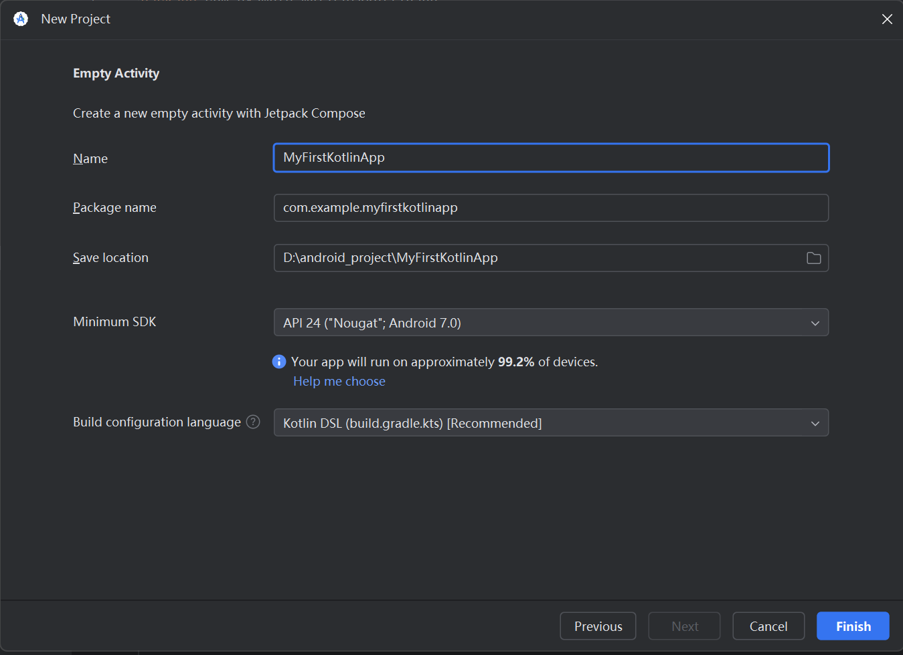
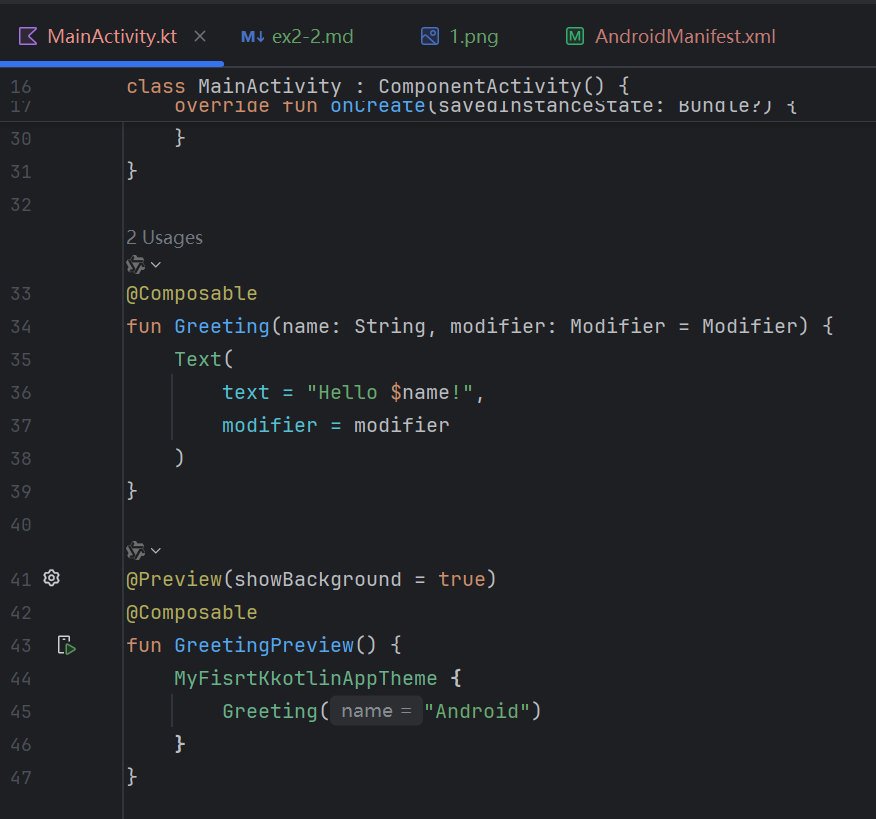
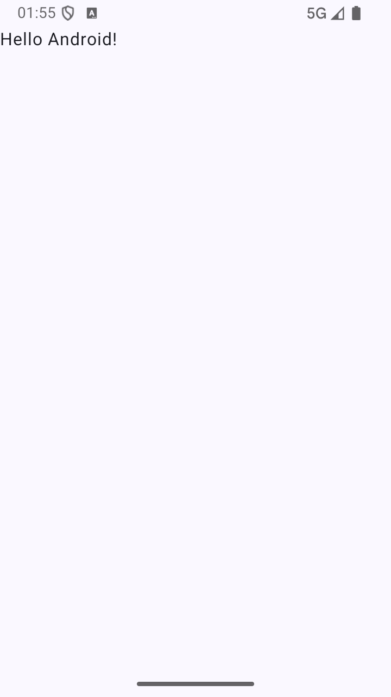
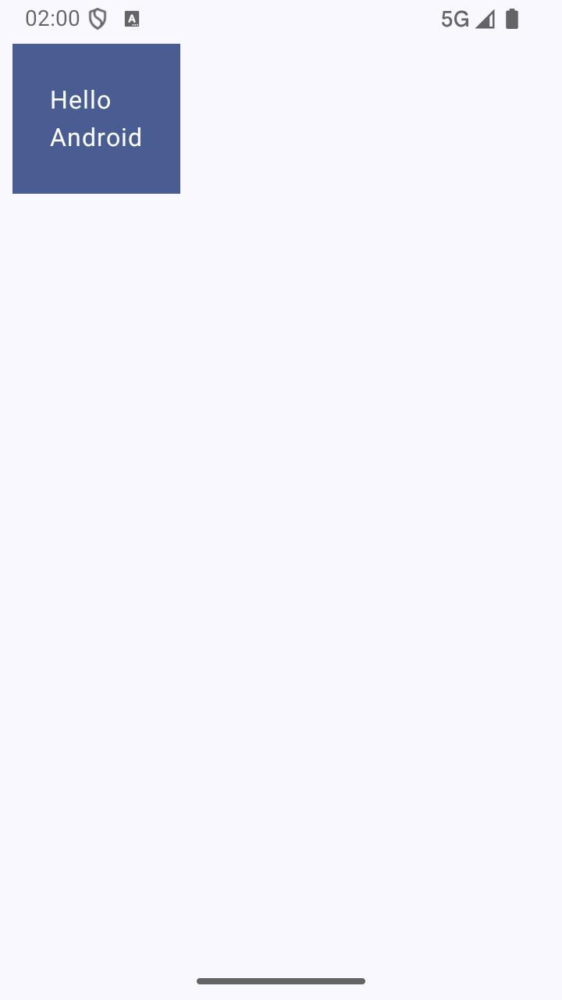
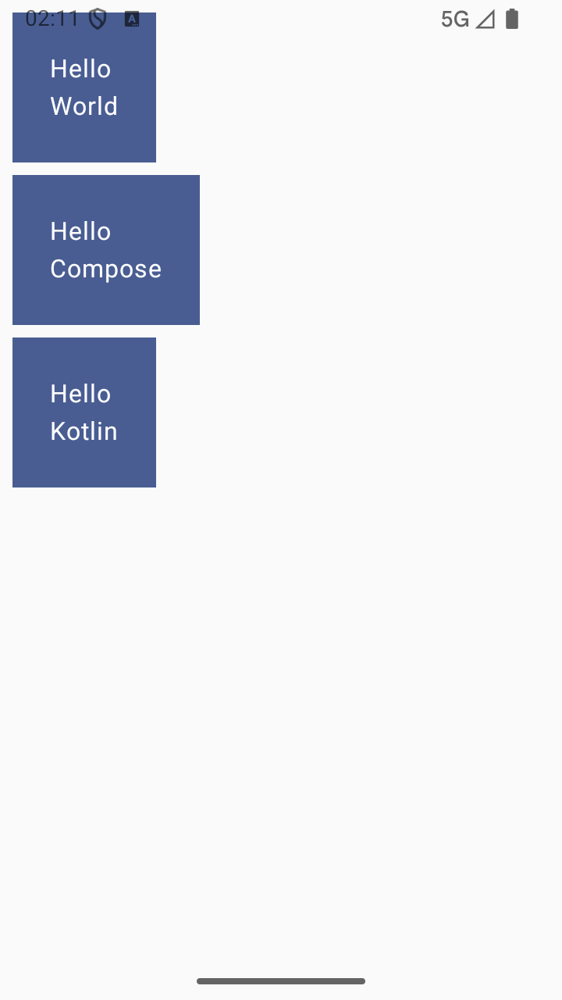
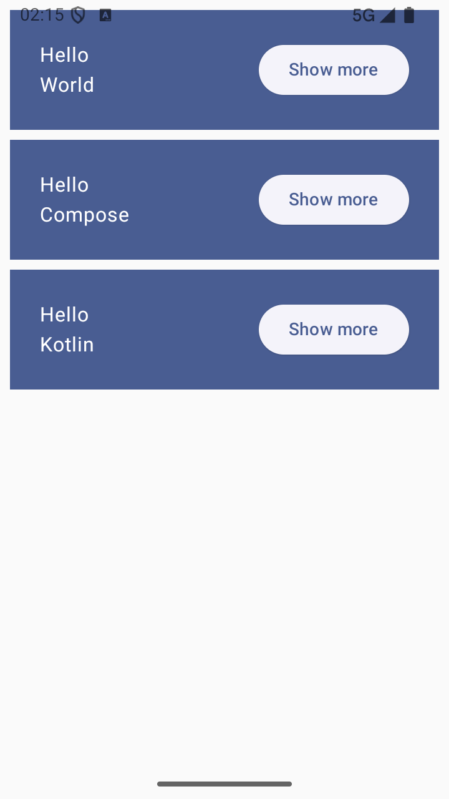
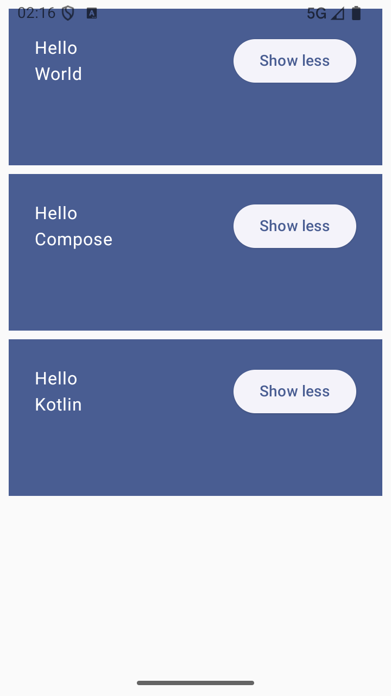
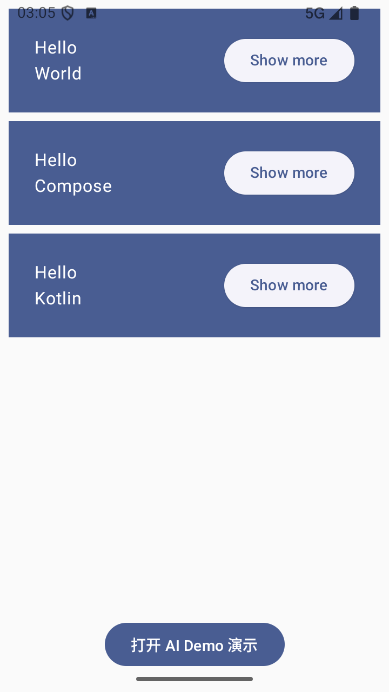
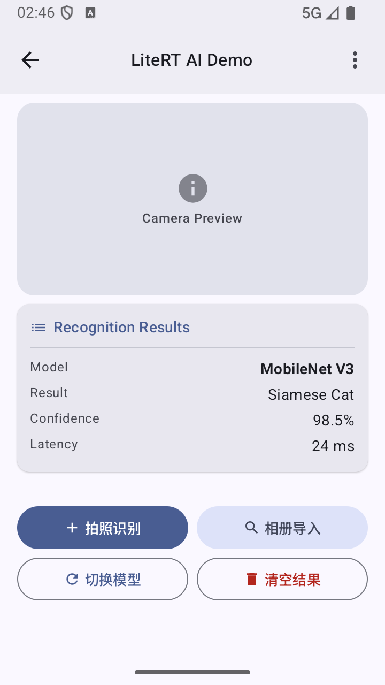

# 构建Kotlin应用并使用Compose布局实验报告

## 实验信息
- **实验名称**：构建Kotlin应用并使用Compose布局
- **任务1**：创建并运行首个 Kotlin+Compose 应用
- **任务2**：Jetpack Compose 基础实践（布局、交互与状态管理）
- **任务3**：完成面向AI应用的Compose布局

---
## 实验目的
- 掌握使用Kotlin语言开发Android的基本流程
- 掌握AndroidCompose布局的基本用法
- 进一步熟悉Kotlin语言的特性

---

## 任务1：首个 Kotlin+Compose 应用

### 实验步骤

1. **创建项目**  
   新建项目 → Empty Activity → 命名 `MyFirstKotlinApp`，语言 Kotlin。
   
   > 截图：项目创建配置界面

2. **查看自动生成的代码**  
   关键代码结构：
   ```kotlin
   class MainActivity : ComponentActivity() {
       override fun onCreate(savedInstanceState: Bundle?) {
           setContent { ... }   // Compose 入口
       }
   }
   
   @Composable
   fun Greeting(name: String, modifier: Modifier = Modifier) { ... }
   
   @Preview(showBackground = true)
   @Composable
   fun GreetingPreview() { ... }
   ```

> 截图：MainActivity.kt 代码

3. **运行应用**  
   
   > 截图：运行结果（显示 "Hello Android!"）

### 任务1小结
- **`@Composable`**: 用于定义可组合函数，是 Compose 构建 UI 的基本单元，支持声明式编程。
- **`setContent`**: 界面入口，用于将 Compose 布局绑定到 Activity 上。
- **`@Preview`**: 强大的实时预览工具，支持在不运行真机/模拟器的情况下查看 UI 的渲染效果。

---

## 任务2：Compose 基础实践

### 实验步骤

1. **修改 Greeting —— 添加背景和内边距**  
   改动点：用 `Surface` 包裹，添加 `Column` 和 `padding`。
   ```kotlin
   Surface(color = MaterialTheme.colorScheme.primary, modifier = modifier.padding(...)) {
       Column(modifier = Modifier.padding(...)) {
           Text("Hello "); Text(name)
       }
   }
   ```
   
   > 截图：修改后的预览/运行效果

2. **创建 MyApp —— 动态生成多个 Greeting**
   ```kotlin
   @Composable
   fun MyApp(modifier: Modifier = Modifier) {
       val names = listOf("World", "Compose", "Kotlin")
       Column(...) {
           for (name in names) { Greeting(name) }
       }
   }
   ```
   同时修改 `setContent` 中调用 `MyApp`。

   > 截图：多个卡片的效果

3. **添加 Row 和按钮**  
   改动点：`Row` 布局，左侧 `Column` 加 `weight(1f)`，右侧加 `ElevatedButton`。
   ```kotlin
   Row(...) {
       Column(modifier = Modifier.weight(1f)) { ... }
       ElevatedButton(onClick = {}) { Text("Show more") }
   }
   ```
   
   > 截图：每个卡片右侧出现按钮

4. **添加状态管理 —— 实现展开/收起**  
   关键改动：
   ```kotlin
   var expanded by remember { mutableStateOf(false) }
   val extraPadding = if (expanded) 48.dp else 0.dp
   
   // 应用到 Column 的 modifier 中
   modifier = Modifier.padding(bottom = extraPadding)
   
   // 按钮文字和点击逻辑
   ElevatedButton(onClick = { expanded = !expanded }) {
       Text(if (expanded) "Show less" else "Show more")
   }
   ```
   
   > 截图1：未展开状态（按钮 "Show more"）    
    
   
   > 截图2：点击后展开状态（底部间距增大，按钮变为 "Show less"）

   
### 任务2小结
- **`remember`**: 用于在重组过程中记住对象的状态。
- **`mutableStateOf`**: 创建可观察的状态，变化时自动触发重组。
- **状态驱动 UI**: 只需修改数据，UI 会自动同步，极大简化了交互开发。
- **`weight` 修饰符**: 用于在 Row 或 Column 中灵活分配剩余空间。

---
## 任务3：AI应用界面实现

### 实验步骤

1. **设计 UI 组件 `AiDemoScreen`**  
   创建一个独立的 Composable 函数，使用 Material 3 的 `Scaffold` 作为骨架，内部通过 `Column` 垂直排列三大核心区域。
   - **相机预览区**：使用 `Box` 模拟取景器，设定 180dp 固定高度，并应用 `RoundedCornerShape(16.dp)` 圆角。
   - **识别结果区**：使用 `ElevatedCard` 承载识别信息，通过 `ResultItemCompact` 辅助函数展示模型名称、结果、置信度及耗时。
   - **操作按钮区**：设计两行按钮，包含“拍照识别”、“相册导入”、“切换模型”和“清空结果”。

2. **界面比例优化与空间利用**  
   为了确保在同一屏幕内完整显示所有内容，移除了弹性占位符 `Spacer(Modifier.weight(1f))`，改用 `Arrangement.spacedBy(8.dp)` 紧凑排列。同时将按钮高度统一为 40dp，文字调整为 13.sp。

3. **Material 3 (M3) 风格美化**  
   - **组件层级**：通过 `surfaceContainer` 系列颜色区分顶部栏和卡片容器。
   - **按钮分层**：主要操作使用填充按钮（`Button`），次要操作使用色调按钮（`FilledTonalButton`），辅助功能使用轮廓按钮（`OutlinedButton`）。
   - **图标引导**：为每个按钮添加了 Material 标准图标，提升视觉可读性。

4. **主界面集成与状态切换**  
   在 `MainActivity` 中通过 `mutableStateOf` 维护 `showAiDemo` 状态。
   ```kotlin
   var showAiDemo by remember { mutableStateOf(false) }
   if (showAiDemo) {
       AiDemoScreen(onBack = { showAiDemo = false })
   } else {
       // 显示主列表及“打开 AI Demo”按钮
   }
   ```

> 截图：主界面与 AI Demo 之间的切换效果


> 截图：最终实现 AI 演示界面

### 任务3小结
通过任务3的实践，我掌握了复杂界面的组件化拆分方法，学会了如何通过精细调节组件高度（如相机预览区 180dp）和内边距，在有限的屏幕空间内实现高效的信息展示。同时，熟练运用了状态驱动 UI 切换的开发模式，并掌握了 Material 3 按钮体系的语义化用法。

---

## 附录
- 任务1原文：https://blog.csdn.net/llfjfz/article/details/147382990
- 任务2原文：https://blog.csdn.net/llfjfz/article/details/147394477
